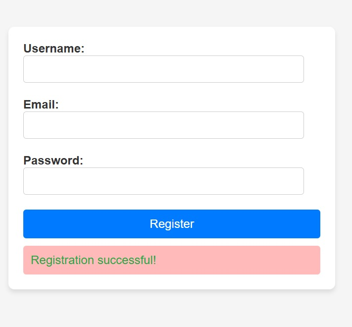

# Form-Creation-Validation

## 📌 Project Overview

This project implements a **form validation system** using **pure JavaScript** (no external libraries). The goal is to ensure that user inputs for **username**, **email**, and **password** meet specific validation rules before the form is successfully submitted.

The form provides **real-time feedback** to users by displaying success or error messages depending on input validity. This improves usability and ensures data integrity before server submission.

---

## 🎯 Learning Objectives

By completing this project, I am able to:

* Explain what **form validation** is and why it is important.
* Use the **DOMContentLoaded** event to ensure scripts run after the page loads.
* Select and manipulate DOM elements using `document.getElementById`.
* Prevent default form submission behavior with `event.preventDefault()`.
* Apply **string methods** like `.trim()` and conditions to validate input fields.
* Dynamically display **feedback messages** using JavaScript and CSS.

---

## 🛠️ Requirements

* **GitHub Repository**: `Form-Creation-Validation`

* Files must include:

  * `index.html` – The form structure
  * `style.css` – Styling for form and feedback messages
  * `script.js` – JavaScript validation logic

* **Constraints**:

  * No external libraries (e.g., React, Bootstrap, jQuery).
  * Code must be **W3C-compliant** and pass validation.
  * All files should end with a new line.

---

## 📂 Project Structure

```
Form-Creation-Validation/
│── index.html
│── style.css
│── script.js
│── README.md
└── assets/
    └── screenshot1.jpg
    └── screenshot4.jpg
    └── screenshot5.jpg
```

---

## ⚙️ Features & Validation Rules

* **Username**:

  * Must be at least 3 characters long.

* **Email**:

  * Must contain both `@` and `.` characters.

* **Password**:

  * Must be at least 8 characters long.

* **Feedback Display**:

  * ✅ Success message → `"Registration successful!"` (green text)
  * ❌ Error messages → Listed per failed validation (red text)

---

## 🚀 How It Works

1. The script runs after the page loads (`DOMContentLoaded`).
2. On form submission:

   * Prevents default server submission.
   * Retrieves and trims user input values.
   * Validates each field based on set criteria.
   * Displays feedback in a dedicated section.
3. User corrects errors until submission passes validation.

---

## 🖥️ Usage

1. Clone the repo:

   ```bash
   git clone https://github.com/<MaudleenTech>/Form-Creation-Validation.git
   cd Form-Creation-Validation
   ```

2. Open `index.html` in a browser.

3. Fill out the form → Click **Submit** → See validation feedback.

---

## 📸 Demo Preview  

Here’s how the form looks in action:  




---

## 👩‍💻 Author

**Maudleen Imonirioma**

* GitHub: [MaudleenTech](https://github.com/MaudleenTech)
* ALX Software Engineering Student

